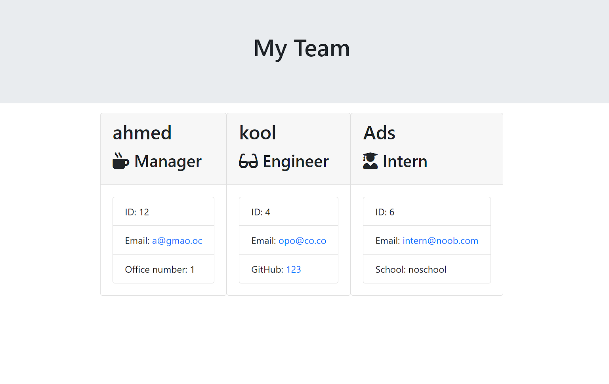

# Team Profile Generator

A Node.js command-line application that dynamically generates a professional `team.html` file from a user's input using the Inquirer package. This application allows users to input information about their development team members and then renders an HTML file showcasing the team's profile.

## Features

- Dynamically generate a team profile page.
- Add team members with roles such as Manager, Engineer, and Intern.
- Each role has specific properties and methods that capture their information.
- Uses Bootstrap for styling the generated HTML page.

## Technologies Used

- Node.js
- Inquirer
- JavaScript (ES6)
- Bootstrap
- Jest (for testing)

## Installation

1. Clone the repository to your local machine.
2. Navigate to the project directory in your terminal.
3. Run `npm install` to install the necessary node modules.

## Usage

1. Run `node index.js` in your terminal.
2. Follow the on-screen prompts to input information about your team members.
3. Once all members are added, the application will generate a `team.html` file in the `output` directory.

## Tests

The application includes Jest tests for the classes (Manager, Engineer, Intern) to ensure that the object creation and method functionality are correct.

## Contributing

If you'd like to contribute, please fork the repository and use a feature branch. Pull requests are warmly welcome.

## Links

- [Repository](https://github.com/bh1ff/teamProfileGenerator)
- [Issue tracker](https://github.com/bh1ff/teamProfileGenerator/issues)

## Licensing

The code in this project is licensed under MIT license.

## Contact Information

- GitHub: [bh1ff](https://github.com/bh1ff)
- Email: [a.ayad@robocode.uk](mailto:a.ayad@robocode.uk)

